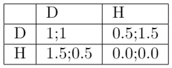
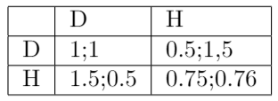

# Evolutionary-Game-Theory

# Idea
The idea of the present work is to study different topics of evolutionary game theory by simulating the evolution of a
population of creatures that interact with each other in order to collect food. 

# Setup
The experiment setup is composed by a fixed amount of a common resource (food in a fixed number of meals)
and a variable number of creatures. In the first generation, a few creatures are generated. These creatures will search for a meal.
Sometimes, a meal will be occupied by two creatures, and in this case they will have to decide how to split the meal. A meal is worth
2 energy points (2E). Energy points dictate the probability that creatures survive, reproduce or die. If creatures obtain less than 1E,
they will be likely to die, if they get exactly 1E, they will remain alive for the next generation, and if they get more than 1E they will
be likely to reproduce, generating identical children that will be part of the subsequent generation. It can also be the case that a meal
is only occupied by one creature. In this case, the creature obtains 2E. When creatures search for food, they will have to looks for meals
that are empty or only occupied by 1 creature. Otherwise, if there are no more empty meals, the creature will obtain 0E, and will therefore
die. The basic creatures presented in this report are Doves and Hawks. Doves are peaceful creatures that share equally meals with other
Doves. Alternatively, Hawks are creatures that fight for food. If a dove and a Hawk occupy, the Hawk will take a greater portion of the
meal than the Dove. Despite this, if two Hawks occupy a meal, they will fight for the food and therefore, they will loose some energy
during the process, which will diminish their reward. The payoffs matrix of such environment might be as following:

Progress of the evolution of two species with stochastic strategies competing for food

# Stochastic strategies
The idea behind stochastic strategies is to assign probabilistic strategies to the creatures. In other words, creatures play
a stochastic strategy instead of a deterministic strategy.

Creatures are born with a probability P which is assigned to the probability of  playing Dove.
Therefore creatures play dove with probability P and creatures  play Hawk with probability 1-P.
Creatures that survive or reproduce to the next generation, carry their probability P to their children/successors.
Therefore, it is possible to analyze which stochastic strategies are dominant and successful. 

To depict the evolution of stochastic strategies, two simulation were created using different payoffs, see Left Table and 
Right Table for results (the green(ish) colours represent playing Dove with high probability, red(ish) colours represent playing
Hawk with high probability)  and tables below for the payoffs. The first simulation (left) is executed using a the basic payoff 
matrix depicted in Left Table, which involves a mixed strategy Nash equilibrium. The second simulation, depicts the Prisoner's
Dilemma situation, where there is only 1 strategy, which involves a pure strategy Nash Equilibrium.

  
   

  
   

Observing the simulation using the mixed strategy Nash Equilibrium payoff matrix, one can conclude that stochastic strategies are also in equilibrium, as there are as many creatures playing Dove with high probability, as creatures being undecided (p close to 0.5), as creatures playing Hawk with high probability. In other words, p is uniformly distributed, meaning that there is no dominant stochastic strategy.

The second simulation presents a very different result. By using a payoff matrix with only one pure Nash equilibrium (Hawk), one can conclude that stochastic strategies are favorable for Hawk preferring creatures, thereby converging to a stable population only contained by hawks.

